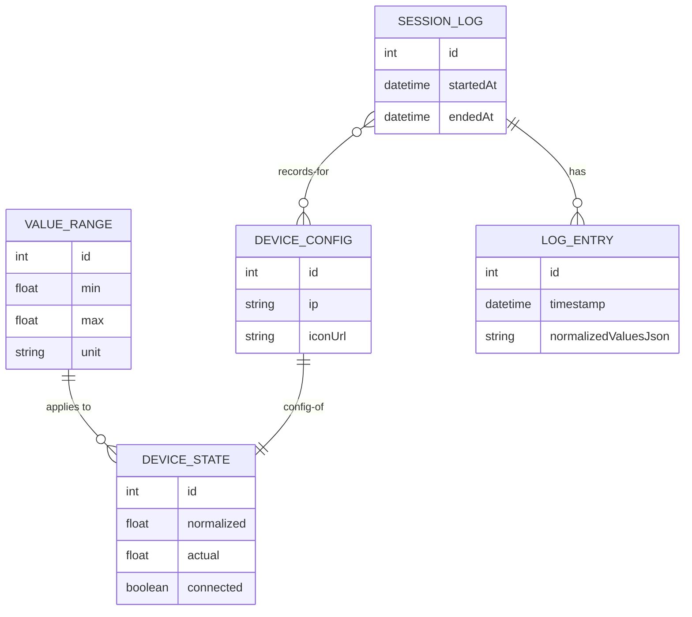

# PositionVisualizer Architecture

## System Overview
最大 6 本のレバー（デバイス）の値をリアルタイムに可視化し、
ログ記録・保存・再生、Overlay（配信用可視化）を提供する Web アプリ。

---

## Domain Model (ER Diagram)


---

## Responsibilities by Layer

### Domain Layer
- ValueRange
- DeviceConfig
- DeviceState
- SessionLog
- LogEntry

純粋なデータロジックのみ。UI や WebSocket を知らない。

---

### UseCase Layer
- LiveMonitorService（値の購読）
- RecordingService（ログ生成）
- ReplayService（ログ再生）
- SettingsService（範囲・単位更新）
- IconService（アイコン設定）

操作のまとまり。外部実装には依存しない。

---

### Infra Layer
- WebSocketBridgeClient / HttpPollingClient
- LogFileStorage / SettingsStorage
- OverlayChannel（BroadcastChannel）

外部との接続（通信・保存など）

---

### Presentation Layer
- MainPageViewModel / OverlayViewModel
- meterRenderer.js / iconRenderer.js
- DOM Bindings

UI ロジックと描画専任モジュール。

---

## Dependency Rule

依存方向は必ず下記に従う：

```text
Presentation → UseCase → Domain
          ↑
        Infra
```

- Domain は何も知らない
- UseCase は Domain だけ知る
- Presentation は UseCase と Infra の抽象を知る
- Infra は Domain / UseCase に注入される

---

## Directory Structure

```text
src/
  domain/
    ValueRange.js
    DeviceConfig.js
    DeviceState.js
    LogEntry.js
    SessionLog.js

  usecases/
    LiveMonitorService.js
    RecordingService.js
    ReplayService.js
    SettingsService.js
    IconService.js

  infra/
    bridge/
      WebSocketBridgeClient.js
      HttpPollingClient.js
    storage/
      LogFileStorage.js
      SettingsStorage.js
    sync/
      OverlayChannel.js

  presentation/
    viewmodels/
      MainPageViewModel.js
      OverlayViewModel.js
    views/
      meterRenderer.js
      iconRenderer.js
    bindings/
      MainPageBindings.js
      OverlayBindings.js

  app/
    main.js
    overlayApp.js

  index.html
  overlay.html
```

---

## Future Rules for Implementation
- renderer は DOM/SVG 描画専任。状態を持たない
- ViewModel は UI 状態と UseCase 呼び出しだけ担当
- UseCase はビジネスロジックを持つが DOM に触らない
- Domain は最も下層で、永続化形式を知らない
